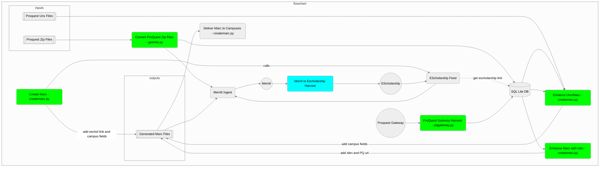

# ETDs Service Scripts

## Component Diagram

---
getetds.py: This script runs Mon-Sat at 07:30.

We receive ETDs from Proquest for UCI, UCM, UCR, UCSC, UCSD and UCSF in the
proquest account. We receive ETDs from UCLA in the uclaetd account.

Run getetds.py to retrieve ETDs:

	$ ./scripts/getetds.py --env [stage | prod] 

The zip files will go to the ./zipfiles directory, be deleted from the SFTP server, and 
submitted to Merritt. Once they are submitted, the zipfiles are moved into a subfolder 
(named YYYYMMDD) in the ./zipfiles directory. The database etd.db will be updated.

---
createmarc.py: This script runs Mon-Sat at 13:30.

Run createmarc.py to generate MARC records and CSV reports, and deliver them via email or
SFTP as appropriate:

        $ ./scripts/createmarc.py --env [stage | prod]

This script will update the eScholarship information, which is needed to include an eScholarship
link in the MARC record. The script needs to run after eScholarship has harvested the new ETDs
from Merritt, and has refreshed the index. 

---
pggateway.py: This script runs Mondays and Thurdays at 10:00.

Run pqgateway.py to update the pq_gateway table in the database etd.db:

        $ ./scripts/pqgateway.py --env [stage | prod]

This script will query Proquest via their XML Gateway whether ETDs are available. The information in
the pq_gateway table is used to include a persistent link to the Proquest copy of the ETD in MARC
records.  

